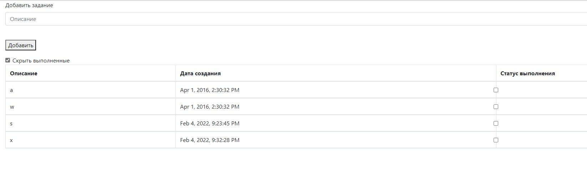

#job4j_todo

ToDo-лист.

"БД", состоящая из одной таблицы: описание задания, время создания, статус выполнения. В качестве СУБД используется Postgresql.

JS-код вынесен в отдельный файл. Для динамической загрузки данных используем AJAX.

Есть единственная страница: добавление задание и просмотр существующих с фильтром выполнен/не выполнен.

