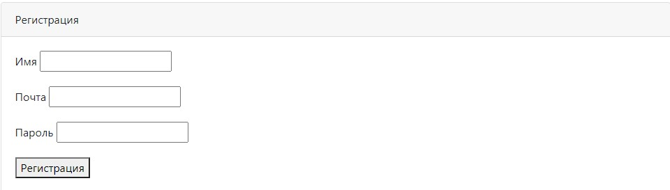
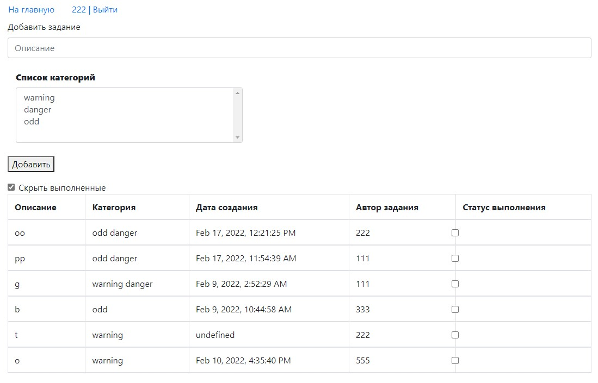

#job4j_todo

ToDo-лист.

"БД", состоящая из следующих таблиц: задание, категория задания, пользователь (автор задания), промежуточная
таблица задание - категория (одно задание может состоять в нескольких категориях). В качестве СУБД 
используется Postgresql.

JS-код вынесен в отдельный файл. Для динамической загрузки данных используем AJAX.

Присутствуют формы регистрации и аутентификации. Есть единственная страница: добавление задания и просмотр 
существующих с фильтром выполнен/не выполнен.

